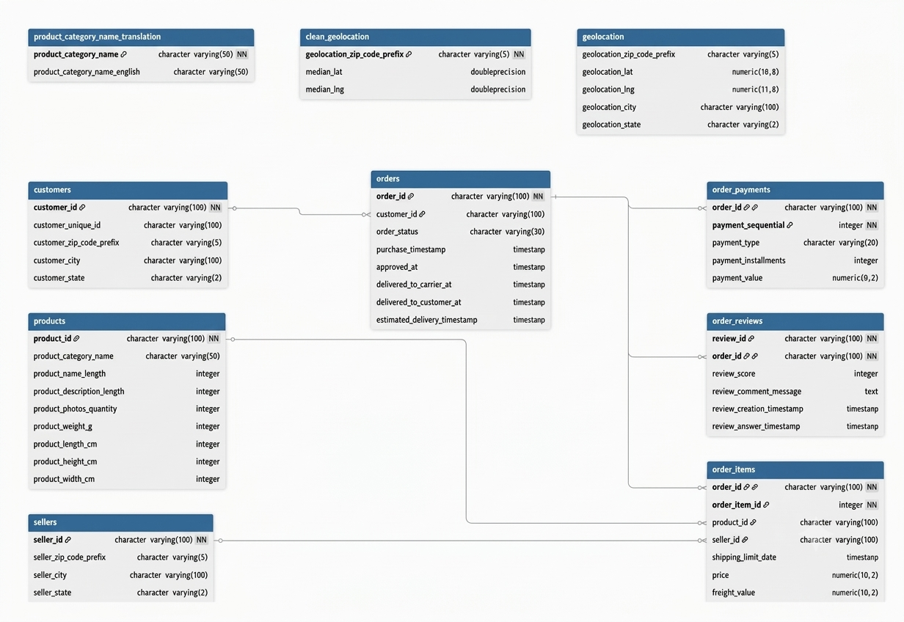

# Brazilian E-Commerce Analysis

SQL analysis of the Brazilian E-Commerce Public Dataset by Olist.

The dataset contains information from an online marketplace, including orders, customers, products, sellers, payments, and reviews. It covers orders placed between 2016 and 2018.

The analysis was done using PostgreSQL.

## Dataset Source

**Brazilian E-Commerce Public Dataset by Olist**

[Dataset on Kaggle](https://www.kaggle.com/datasets/olistbr/brazilian-ecommerce)

## Dataset & Schema

The dataset contains data from the Olist marketplace, covering customers, orders, products, sellers, payments, reviews, and geolocation.

### Main Tables

| Table | Grain | Key |
|---|---|---|
| `orders` | One row per order | `order_id` |
| `order_items` | One row per item within an order | `order_id + order_item_id` |
| `customers` | One row per customer order relationship | `customer_id` |
| `products` | One row per product | `product_id` |
| `sellers` | One row per seller | `seller_id` |
| `order_reviews` | Review associated with an order | `review_id` |
| `order_payments` | One row per payment method used in an order | `order_id + payment_sequential` |
| `geolocation` | Multiple location records per ZIP code prefix | `geolocation_zip_code_prefix` |
| `product_category_name_translation` | One row per product category | `product_category_name` |

### Key Relationships

- `orders.customer_id` → `customers.customer_id`
- `order_items.order_id` → `orders.order_id`
- `order_items.product_id` → `products.product_id`
- `order_items.seller_id` → `sellers.seller_id`
- `order_reviews.order_id` → `orders.order_id`
- `order_payments.order_id` → `orders.order_id`

`customer_unique_id` in `customers` identifies the actual customer across orders and is used for customer-level and repeat-customer analysis.

## Data Preparation

- Removed `review_comment_title` because approximately 88% of its values were missing.
- Kept `review_comment_message` despite missing values.
- When multiple reviews existed for an order, the latest review based on `review_answer_timestamp` was retained.
- Created `clean_geolocation` with one representative latitude and longitude per ZIP code prefix, using the median coordinates.
- Duplicate records were checked and handled where necessary.

## Methodology

- Analyses involving sales, customers, products, and delivery performance use **delivered orders** for analysis.
- Revenue is calculated using `price + freight_value` from `order_items`.
- `payment_value` is used for payment method analysis and is not treated as the project's revenue metric.
- 2016 is excluded from trend analysis because of sparse records. Trend analysis begins in January 2017.
- Customer level analysis uses `customer_unique_id` instead of `customer_id` to identify individual customers across orders.
- Customer segments are defined as:
  - **High value:** ≥ R$500
  - **Mid value:** R$200–499
  - **Low value:** < R$200

## Business Questions

- How are orders distributed across different order statuses?
- How does revenue change over time?
- How concentrated is revenue across customers and products?
- Which products and states generate the most revenue?
- Are sellers shipping orders on time?
- Which states have higher late order rates?
- Do late deliveries tend to receive lower review scores?

## Key Findings

### Sales

- November 2017 recorded the highest monthly revenue at **R$1,153,364.20**, coinciding with the highest order volume and the Black Friday period.
- January 2017 recorded the lowest monthly revenue at **R$127,482.37**, coinciding with the lowest order volume and active seller count.

### Customers

- **2,997 customers** placed more than one delivered order, representing approximately **3%** of customers.
- The highest revenue customer generated **R$13,664.08** from 2 orders and 8 items.
- Among repeat customers, `da122df9eeddfc1dc1f5349a1a690c` generated the highest revenue at approximately **R$7,571.63** from 2 delivered orders and 2 items.

### Products & Regions

- `health_beauty` was the highest-revenue product category.
- São Paulo (SP) generated the highest revenue among states.
- Approximately **28% of products accounted for 80% of total revenue**.

### Sellers & Delivery

- Approximately **9% of delivered orders were shipped late to the carrier**.
- Alagoas (AL) had the highest late-order rate at approximately **23.93%**, followed by Maranhão (MA) at **19.67%**.

### Reviews

- Late deliveries received substantially lower average review scores than on-time deliveries.

## Recommendations

- Focus on reducing late deliveries, especially in states with higher late order rates, as late orders received substantially lower review scores.
- Monitor high revenue products and customers because a relatively small share of products accounts for a large share of revenue.
- Review seller shipping performance to identify sellers contributing to late handoffs to carriers.

## SQL Analysis

The SQL work is organized into three sections:

- [`cleaning/`](sql/cleaning/) — data cleaning and preparation
- [`eda/`](sql/eda/) — exploratory analysis
- [`analysis/`](sql/business_analysis/) — business-focused analysis

## Tools

- PostgreSQL
- SQL
- Git & GitHub
- VS Code

